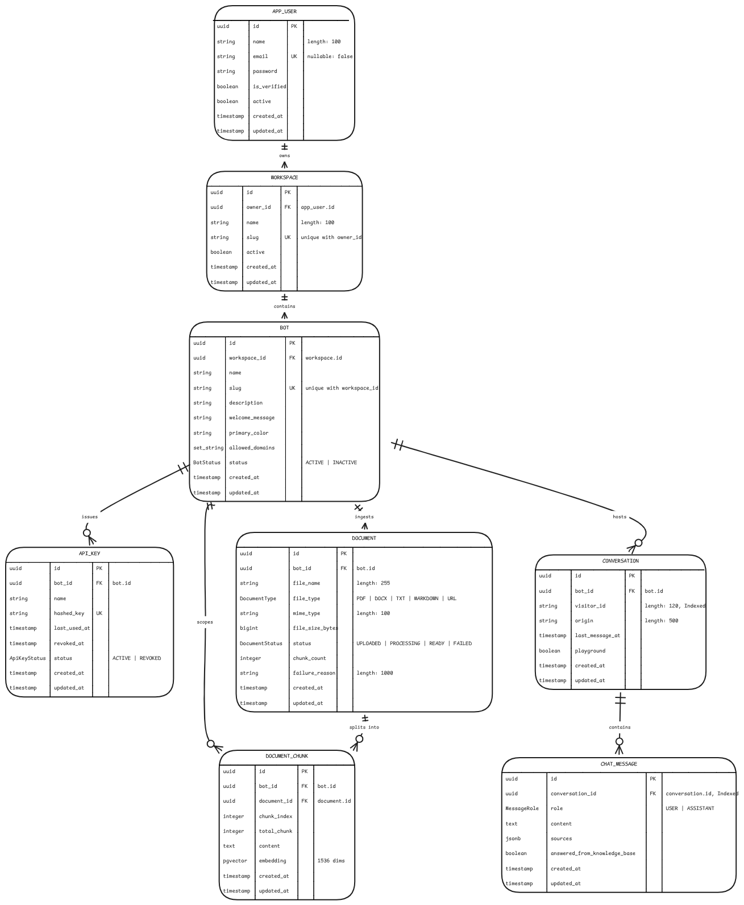

<div align="center">

  <!-- 📷 ADD YOUR LOGO HERE -->
  

  # Omybott (backend)

  <p>
    <strong>The robust, secure, and highly-scalable Java engine powering the Omybott multi-tenant RAG platform.</strong>
  </p>

  <p>
    <a href="#-architecture--routes">Architecture & Routes</a> •
    <a href="#-tech-stack">Tech Stack</a> •
    <a href="#-getting-started">Getting Started</a>
  </p>

  <a href="#">
    
  </a>
</div>

<br/>

## 🌟 Overview
The backend service for Omybott handles complex document ingestion, vector embeddings, RAG (Retrieval-Augmented Generation) workflows, and secure API key management for embeddable chatbots. Built with Spring Boot and Spring AI, it is designed from the ground up for multi-tenant scalability, exposing clean REST APIs for both the dashboard and embedded external widgets.

---

## 🏗️ Architecture & Routes

### 🗄️ Database Schema

The following ER Diagram maps out the PostgreSQL schema, including the pgvector implementation for document chunks:



Omybott's backend exposes a comprehensive set of RESTful endpoints to support its multi-tenant structure and AI functionalities:

| Domain | Key Endpoints | Description |
|---|---|---|
| **Authentication** | `/auth/login`, `/auth/register` | JWT-based authentication and secure user registration. |
| **Users** | `/users/me` | Fetch and update authenticated user details and profiles. |
| **Workspaces** | `/workspaces` | Multi-tenant organization. Endpoints to CRUD workspaces for different clients. |
| **Bots** | `/workspaces/{wsId}/bots` | Manage specialized AI assistants within specific workspaces. |
| **API Keys** | `/api-keys` | Generate, list, and revoke API keys used to secure external bot embeds. |
| **Documents** | `/documents/upload` | Ingestion pipeline: Parse PDFs/documents, chunk content, generate vectors, and store in pgvector. |
| **Chat (RAG)** | `/chat` | The core inference engine. Retrieves context from pgvector and streams AI responses securely. |
| **Public Chat** | `/public/chat` | Cross-origin endpoint used by the **embedded widget** from any external domain, authenticated via API Key. |
| **Agent Mode** | `/agent` | AI-driven management using **Spring AI Tool Calling** to interact with the system via natural language. |

---

## 🔥 Highlight Features

### Agent Mode (LLM Tool Calling)
Instead of forcing users to click through dashboards manually, our backend exposes an `/agent` endpoint. Powered by **Spring AI's function calling capabilities**, it allows the LLM to execute secure backend operations—like creating workspaces or provisioning bots—autonomously based on natural language prompts from the user.

### "Embed Anywhere" Security
To power our "Embed Anywhere" feature on the frontend, the backend supports two distinct, tightly-controlled authentication flows:
1. **JWT Auth:** Standard token security for the main web dashboard (managing workspaces, bots, and documents).
2. **API Key Auth:** A lightweight, highly-secure validation layer specifically designed to authorize requests coming from the embedded web chat widgets deployed on external, third-party customer sites.

---

## 🛠️ Tech Stack

Our backend is built on a cutting-edge, enterprise-grade Java stack:

| Category | Technology | Description |
|---|---|---|
| **Core** | **Java 25**, **Spring Boot 4.1.0** | Bleeding-edge Java and Spring framework for maximum performance and modern language features. |
| **AI Integration** | **Spring AI 2.0.0** | Orchestrates LLM interactions, RAG workflows, PDF parsing, and Function/Tool calling. |
| **Database & Vector Store** | **PostgreSQL** with **pgvector** | Relational storage paired with `hibernate-vector` for highly efficient similarity searches. |
| **Security** | **Spring Security**, **JJWT (0.13.0)** | Robust security layer supporting standard JWT sessions and external API key validation. |
| **Data Mapping** | **ModelMapper (3.2.6)** | Clean and efficient mapping between database Entities and REST DTOs. |
| **Boilerplate** | **Lombok** | Reduces verbosity for cleaner, more maintainable model classes. |

---

## 🚀 Getting Started

### Prerequisites
- Java Development Kit (JDK 25)
- Maven
- PostgreSQL database (with `pgvector` extension enabled)
- Docker (optional, but highly recommended for quick database setup)

### 🐳 Docker & Deployment Setup
We provide a **`docker-compose.yml`** to instantly spin up the required PostgreSQL database equipped with the `pgvector` extension.
```bash
docker compose up -d postgres
```

For seamless production deployment, the backend includes a highly-optimized, multi-stage **`Dockerfile`**. It builds the application cleanly using Maven and packages it as a lightweight Java 25 runtime image.
```bash
docker build -t omybott-backend .
docker run -p 8080:8080 -e OPENAI_API_KEY=your_key omybott-backend
```

### Installation

1. Clone the repository:
   ```bash
   git clone <repository-url>
   ```

2. Configure application properties:
   Update your configuration (e.g., `src/main/resources/application.yml` or `application.properties`) with your database credentials and required AI API keys.
   ```yaml
   spring:
     datasource:
       url: jdbc:postgresql://localhost:5432/omybott
       username: myuser
       password: mypassword
     ai:
       openai:
         api-key: ${OPENAI_API_KEY}
   ```

3. Build the project:
   ```bash
   ./mvnw clean install
   ```

4. Run the application:
   ```bash
   ./mvnw spring-boot:run
   ```

The REST API will be available at `http://localhost:8080`.